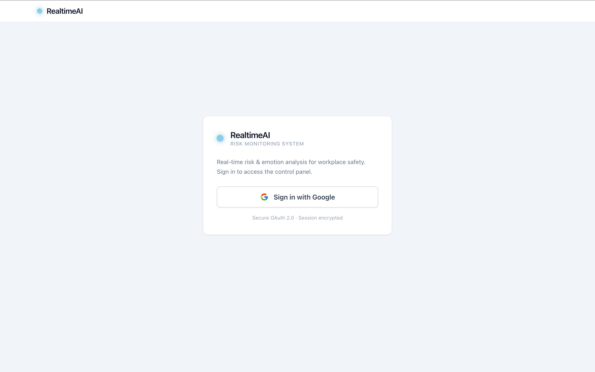
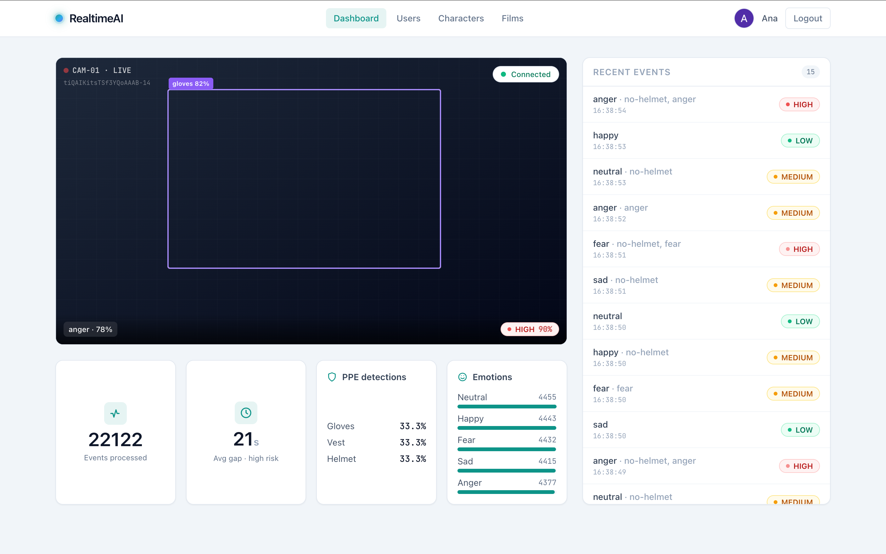
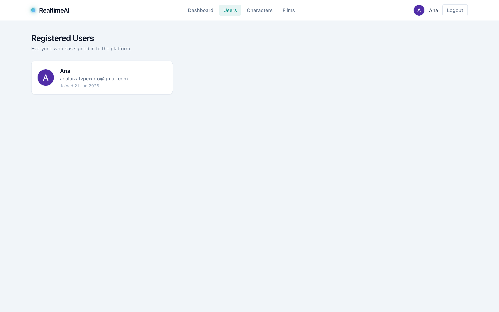
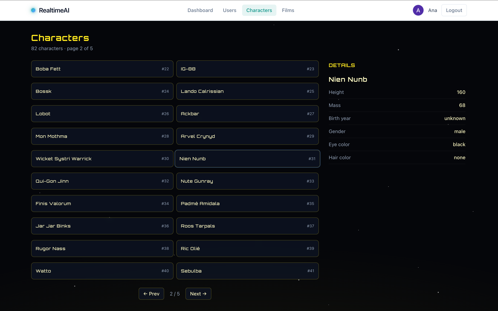
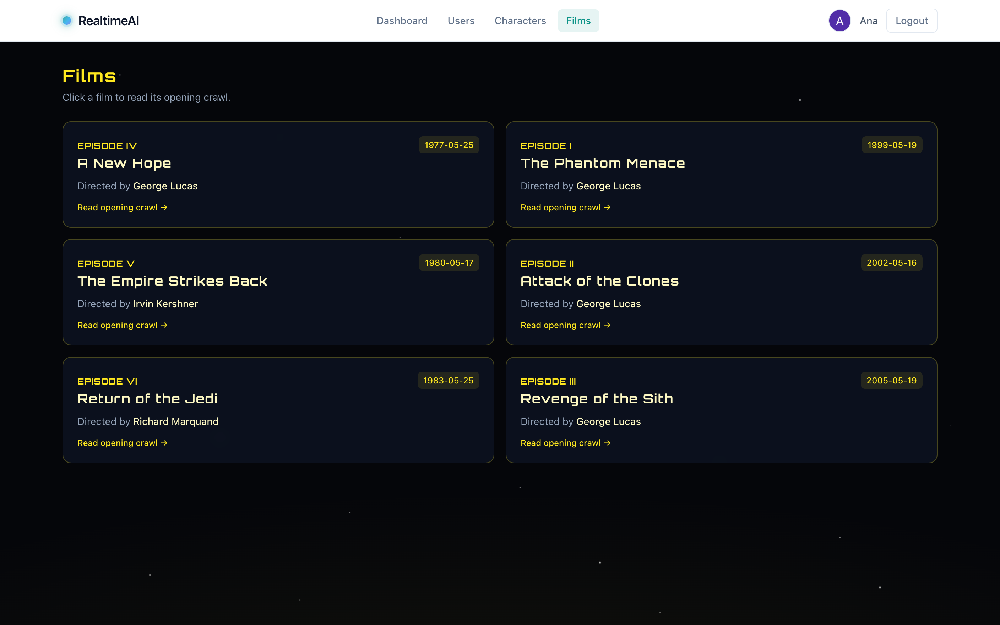

# Realtime AI Platform

Plataforma de análise de **risco e emoção em tempo real** para segurança do trabalho —
detecta uso de EPI (Equipamento de Proteção Individual) e estado emocional a partir de
frames de câmera, classifica o nível de risco e transmite os resultados ao vivo.

### 🚀 Demo ao vivo

- **Aplicação:** https://realtime-ai-frontend.onrender.com
- **API:** https://realtime-ai-backend-uf4r.onrender.com/health

> Hospedado no Render (plano gratuito). O backend "dorme" após ~15 min de inatividade,
> então a primeira requisição pode levar ~30–50s para responder.

> **Nota de transparência:** este projeto foi desenvolvido com forte apoio de IA
> (*AI-assisted*). Conduzi a direção do trabalho — priorização, escolhas de design e
> validação de cada etapa — e busquei compreender o porquê de cada parte entregue.
> Sendo honesta, parte do conteúdo (em especial as respostas dissertativas da Parte 3 e
> várias decisões de arquitetura) foi elaborada com apoio significativo da IA; sozinha,
> hoje eu não teria repertório para respondê-las nesse nível. Encaro isso como parte do
> meu processo de aprendizado e estou comprometida em aprofundar esses temas.

O motor de inferência é simulado por um **MockProvider determinístico**, projetado para ser
substituído por um modelo real (ONNX, REST, Azure) sem quebrar o contrato da aplicação.

> Projeto desenvolvido como teste técnico Full Stack. Backend e frontend ficam em
> diretórios separados (`backend/` e `frontend/`).

---

## Stack

| Camada | Tecnologia |
|--------|-----------|
| Linguagem | TypeScript / Node.js 20 |
| Backend | NestJS |
| Banco de dados | MongoDB (Mongoose) |
| Frontend | Nuxt 3 (Vue 3) + Tailwind CSS |
| Tempo real | WebSocket (Socket.IO) |
| Autenticação | Google OAuth2 + JWT (cookie httpOnly) |
| Testes | Jest |

---

## Arquitetura (visão geral)

```
┌─────────────────────────┐         ┌──────────────────────────────┐
│        Frontend          │  HTTP   │           Backend            │
│       (Nuxt 3 SPA)       │ ──────► │          (NestJS)            │
│                          │         │                              │
│  • Login Google          │◄──────► │  AuthModule   (OAuth2 + JWT) │
│  • Lista de usuários      │  WS     │  UsersModule  (MongoDB)       │
│  • SWAPI (people/films)  │ ◄─────► │  SwapiModule  (API externa)   │
│  • Dashboard tempo real  │         │  InferenceModule:             │
│                          │         │   - MockProvider (Pattern)    │
└─────────────────────────┘         │   - Circuit breaker / retry   │
                                     │   - WebSocket stream (500ms)  │
                                     │   - Agregações MongoDB        │
                                     │   - /health/metrics           │
                                     └──────────────┬───────────────┘
                                                    │
                                            ┌───────▼────────┐
                                            │  MongoDB Atlas │
                                            │ events / users │
                                            └────────────────┘
```

O ponto central do design é o **Provider Pattern**: o motor de inferência é acessado por uma
interface (`InferenceProvider`), hoje implementada pelo `MockProvider`. Trocar por um modelo
real significa criar uma nova classe que implementa a mesma interface e alterar **uma linha**
no módulo — o restante da aplicação não muda. (Veja o ADR no fim deste documento.)

---

## Como executar

### Pré-requisitos
- Node.js 20+
- Uma conta no [MongoDB Atlas](https://cloud.mongodb.com) (cluster gratuito M0)
- Credenciais de OAuth no [Google Cloud Console](https://console.cloud.google.com)
  - Tipo: *Aplicativo da Web*
  - URI de redirecionamento autorizado: `http://localhost:3001/auth/google/callback`

### 1. Backend

```bash
cd backend
npm install
cp .env.example .env      # preencha as variáveis (veja abaixo)
npm run start:dev         # sobe em http://localhost:3001
```

Variáveis do `.env`:

| Variável | Descrição |
|----------|-----------|
| `PORT` | Porta do backend (use `3001`) |
| `MONGODB_URI` | String de conexão do MongoDB Atlas |
| `GOOGLE_CLIENT_ID` | Client ID do Google OAuth |
| `GOOGLE_CLIENT_SECRET` | Client Secret do Google OAuth |
| `GOOGLE_CALLBACK_URL` | `http://localhost:3001/auth/google/callback` |
| `JWT_SECRET` | Texto aleatório longo para assinar o JWT |
| `FRONTEND_URL` | `http://localhost:3000` |
| `SWAPI_BASE_URL` | `https://www.swapi.tech/api` |

### 2. Frontend

```bash
cd frontend
npm install
npm run dev               # sobe em http://localhost:3000
```

O frontend usa `http://localhost:3001` como API por padrão. Para apontar para outra URL,
defina `NUXT_PUBLIC_API_BASE`.

### 3. Testes (backend)

```bash
cd backend
npm test                  # ou: npx jest src/inference
```

### 4. Docker (opcional)

Com o `backend/.env` preenchido, sobe os dois serviços de uma vez:

```bash
docker compose up --build
```

- Frontend: http://localhost:3000
- Backend: http://localhost:3001

Cada serviço também tem seu `Dockerfile` próprio e pode ser construído isoladamente
(`docker build -t realtime-backend ./backend`).

---

## Rotas principais (backend)

| Método | Rota | Descrição | Auth |
|--------|------|-----------|------|
| GET | `/health` | Health check | — |
| GET | `/auth/google` | Inicia o login com Google | — |
| GET | `/auth/google/callback` | Callback do OAuth, seta o cookie | — |
| GET | `/auth/me` | Usuário logado | JWT |
| GET | `/auth/logout` | Encerra a sessão | — |
| GET | `/users` | Lista os usuários cadastrados | JWT |
| GET | `/swapi/people?page=&limit=` | Personagens (paginado) | — |
| GET | `/swapi/films` | Filmes | — |
| POST | `/inference/frames` | Roda a inferência em um frame | — |
| GET | `/events/recent?limit=` | Eventos recentes | — |
| GET | `/events/stats` | Agregações (EPI %, emoções, tempo entre riscos) | — |
| GET | `/health/metrics` | Latência média, taxa de erro, eventos, circuit breaker | — |
| WS | `ws://localhost:3001` | Stream de frames a cada 500ms (auth por token/cookie) | token |

Exemplo de resposta do `POST /inference/frames`:

```json
{
  "emotions": [{ "label": "happy", "score": 0.83 }],
  "ppe": [{ "class": "helmet", "score": 0.91, "bbox": [12, 30, 120, 160] }],
  "risk": { "level": "HIGH", "score": 0.85, "reasons": ["no-helmet", "anger"] },
  "latency_ms": 14
}
```

---

## Capturas de tela

### Login


### Dashboard em tempo real
Player com overlay de bounding boxes, painel de eventos recentes e estatísticas agregadas.


### Usuários


### SWAPI — Personagens (tema Star Wars)


### SWAPI — Filmes


---

## Parte 3 — Questões Dissertativas

### 1. Como substituir o MockProvider por um modelo real (ONNX, REST, Azure) sem quebrar o contrato?

A aplicação já foi desenhada para isso através do **Provider Pattern**. Existe uma interface
`InferenceProvider` com um único método (`infer(frame): Promise<InferenceResult>`), e o
`MockProvider` é apenas uma das implementações. O `InferenceService` depende da **interface**,
nunca da classe concreta — a ligação é feita por injeção de dependência através do token
`INFERENCE_PROVIDER` no módulo.

Para plugar um modelo real, eu criaria uma nova classe que implementa a mesma interface, por
exemplo:

- **ONNX (local):** um `OnnxProvider` que carrega o modelo com `onnxruntime-node`, faz o
  pré-processamento do frame (resize/normalização), roda a inferência e mapeia a saída para o
  `InferenceResult`.
- **REST/Azure (remoto):** um `AzureProvider` que envia o frame para o endpoint do serviço e
  traduz a resposta para o mesmo contrato.

A troca é de **uma linha** no módulo (`useClass: MockProvider` → `useClass: OnnxProvider`), ou,
melhor ainda, escolhida por variável de ambiente (`INFERENCE_PROVIDER=onnx`), permitindo
alternar sem recompilar. Como o **contrato de saída** (`emotions`, `ppe`, `risk`,
`latency_ms`) permanece idêntico, controller, persistência, WebSocket e frontend não mudam.
As camadas de resiliência (timeout, retry, circuit breaker) que já envolvem a chamada passam a
proteger o modelo real — que, sendo mais lento e instável que o mock, se beneficia ainda mais
delas.

### 2. Quais métricas e estratégias para avaliar a qualidade do modelo em produção? Como detectar drift e viés?

**Métricas de qualidade do modelo:**
- **Precision, recall e F1** por classe de EPI e por emoção — exigem um conjunto rotulado
  (amostragem revisada por humanos). Em segurança, o **recall** de "ausência de EPI" é crítico:
  um falso negativo significa não alertar um risco real.
- **Matriz de confusão** para entender *onde* o modelo erra (ex.: confunde "colete" com "blusa").
- **Calibração de confiança:** o score 0.9 corresponde mesmo a ~90% de acerto?
- **Latência (p50/p95/p99)** e **taxa de erro** — já expostas em `/health/metrics`.

**Estratégias de monitoramento:**
- Logar **distribuições de saída** (níveis de risco, classes detectadas, emoções) ao longo do
  tempo e comparar com uma janela de referência.
- **Shadow mode / amostragem rotulada:** rotular periodicamente uma amostra dos frames de
  produção para recalcular as métricas reais.

**Detecção de drift:**
- **Data drift (entrada):** comparar a distribuição das features de entrada (brilho, resolução,
  horário, tipo de cena) entre treino e produção, usando testes como **KL-divergence**,
  **PSI (Population Stability Index)** ou **Kolmogorov–Smirnov**. Câmera nova, obra diferente ou
  mudança de iluminação deslocam a distribuição.
- **Concept drift (saída):** monitorar se a distribuição de previsões muda sem mudança
  correspondente no mundo real (ex.: subida súbita de "HIGH risk").

**Detecção de viés:**
- Avaliar as métricas **segmentadas** por subgrupos (tom de pele, gênero, iluminação, tipo de
  EPI). Disparidade sistemática de recall entre grupos indica viés — em análise de pessoas isso
  é especialmente sensível e precisa de auditoria contínua e dados de avaliação representativos.

### 3. Como aplicar os princípios da LGPD para armazenar eventos com imagens de pessoas?

Imagem de rosto e dado emocional são **dados pessoais sensíveis** (biométricos). Princípios e
medidas que eu aplicaria:

- **Minimização e finalidade:** não armazenar o frame bruto por padrão. O sistema já persiste
  apenas **metadados** (classes detectadas, nível de risco, timestamps), que é o suficiente para
  os relatórios. A imagem só seria guardada se houver finalidade explícita e justificada.
- **Base legal:** definir a base adequada (ex.: cumprimento de obrigação de segurança do
  trabalho ou legítimo interesse), com **transparência** — aviso visível de que o ambiente é
  monitorado.
- **Anonimização/pseudonimização:** quando a imagem for necessária, aplicar **blur de rosto**
  por padrão e separar identificadores diretos. Trabalhar com IDs pseudônimos em vez de nomes.
- **Retenção e expiração:** política de retenção curta com **TTL** (o MongoDB suporta índice TTL
  para expirar documentos automaticamente). Descartar o que não é mais necessário.
- **Segurança:** criptografia em trânsito (TLS) e em repouso, **controle de acesso** por papéis,
  e **trilha de auditoria** de quem acessou o quê.
- **Direitos do titular:** prever mecanismos de acesso, correção e **eliminação** dos dados a
  pedido, além de relatório de impacto (RIPD) para um tratamento de alto risco como esse.

### 4. Estratégia segura de rollout e monitoramento para o novo provider

Eu faria uma implantação **gradual e reversível**, aproveitando o Provider Pattern:

1. **Shadow mode:** o novo provider roda **em paralelo** ao mock/atual, recebendo o mesmo
   tráfego, mas suas respostas **não afetam** o usuário — apenas são logadas e comparadas.
   Mede-se latência, taxa de erro e divergência de decisões sem risco.
2. **Canary release:** liberar o novo provider para uma **fração pequena** do tráfego (ex.: 5%)
   via *feature flag* / variável de ambiente. Acompanhar as métricas de `/health/metrics` e as
   de qualidade desse subconjunto.
3. **Rollout progressivo:** aumentar a fração (5% → 25% → 50% → 100%) enquanto as métricas se
   mantêm dentro do esperado.
4. **Guardrails e rollback automático:** definir limiares (ex.: taxa de erro acima de X% ou p95
   de latência acima de Y ms) que disparam **rollback imediato** para o provider anterior. O
   **circuit breaker** já existente protege contra falhas em cascata durante a transição.
5. **Observabilidade:** alertas sobre latência, taxa de erro e drift; logs estruturados com
   `requestId` para rastrear cada inferência; e um período de comparação A/B entre o provider
   antigo e o novo antes de desativar o antigo.

---

## ADR — Architecture Decision Record

### Contexto
Construir uma plataforma de inferência em tempo real que **simula** um motor de IA, mas com
arquitetura pronta para receber um modelo real, priorizando desacoplamento, resiliência e
observabilidade.

### Decisões

**1. Provider Pattern para o motor de inferência.**
O motor é acessado por uma interface (`InferenceProvider`) e injetado por token. *Por quê:*
permite trocar mock por modelo real (ONNX/Azure) sem tocar em controller, persistência ou
frontend. *Trade-off:* uma indireção a mais, compensada pela testabilidade e flexibilidade.

**2. Cálculo de risco como função pura.**
A regra de risco (`computeRisk`) é separada do provider, sem I/O. *Por quê:* fica trivial de
testar e independe de como as detecções foram geradas.

**3. Resiliência em camadas (timeout → retry → circuit breaker).**
Toda chamada ao provider é envolvida por essas camadas. *Por quê:* um modelo real é lento e
falha; o sistema precisa degradar com segurança em vez de travar. *Trade-off:* mais código,
porém isolado em utilitários reutilizáveis e testados.

**4. JWT em cookie httpOnly (em vez de localStorage).**
*Por quê:* o cookie httpOnly não é acessível por JavaScript, mitigando roubo de token via XSS.
Funciona entre as portas 3000/3001 por serem *same-site*.

**5. Agregações no MongoDB (aggregation pipeline).**
As três consultas exigidas (EPI %, emoções, tempo entre riscos altos) rodam no banco, com
índices. *Por quê:* escala melhor do que carregar todos os eventos na aplicação.

**6. Frontend em modo SPA (`ssr: false`).**
*Por quê:* a autenticação depende do cookie do navegador e o painel é totalmente tempo-real;
SSR não agregaria valor e complicaria o acesso ao cookie no servidor.

**7. SWAPI via mirror configurável.**
A URL fica no `.env` e usa `swapi.tech` (o `swapi.dev` original fica fora do ar com frequência).
*Por quê:* trocar a fonte é mudar uma variável, sem tocar no código; a resposta é normalizada
para o frontend não depender do formato externo.

---

## Estrutura do repositório

```
realtime-ai-platform/
├── backend/      → API NestJS (auth, users, swapi, inference)
│   └── src/
│       ├── auth/         → Google OAuth2 + JWT
│       ├── users/        → cadastro e listagem
│       ├── swapi/        → consumo da API pública
│       └── inference/    → Provider Pattern, resiliência, WS, agregações, métricas
└── frontend/     → SPA Nuxt 3 (login, users, swapi, dashboard)
    └── app/
        ├── components/   → RiskBadge, VideoOverlay, StatsPanel, EventsPanel...
        ├── composables/  → useApi, useInferenceStream
        ├── pages/        → login, dashboard, users, swapi/*
        └── stores/       → auth (Pinia)
```
